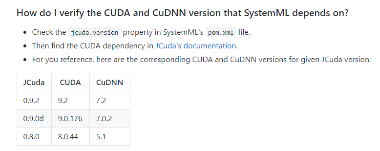

### Systemml安装指南（基于pyspark编程）

#### systemml官方信息
systemml[项目官网]: (http://systemml.apache.org/)
systemml[官方文档]: (http://systemml.apache.org/)
systemml[github]: (https://github.com/apache/systemml)

<!--more-->

#### 环境配置和成功安装所需版本信息
systemml目前的最新版本是1.2.0，但是可以预见的是1.3.0发布的日期不会太遥远。因为目前官网上的docs的latest版本已经升级为1.3.0了，而且还在持续更新。

以下配置是安装在笔者电脑上的环境。
	**A.支持基本语法和算法的环境：**
	Java version == 1.8.0_161  +  Spark version == 2.4.0  +  systemml version == 1.2.0  +  任意python3.5+或2.7+
	**B.支持深度学习算法的环境：**
	A + python version == 2.7.15（尽管systemml官方网站给出的python版本信息是3.5+和2.7+均可，然而经过实验，python3对于systemml的深度学习模块并不支持，比如Caffe2DML等模块在import时会报错）
	**C.支持GPU运行的环境：**
	A + B + CUDA (version == 9.0) + cuDnn (version == 7.0.5)
	(CUDA和cudnn前两位的版本号很重要，必须相同，目前对新版本,即CUAD >= 9.1和cudnn >= 7.1均不支持)
	
以上配置均部署于win10环境下，相对来说，在linux下进行的环境部署会较为简单，但笔者并未尝试。

在2019年3月下旬，官方更新了Q&A，并给出了详细的推荐JCuda，CUDA，CuDNN组合版本，如下图所示，仅供参考：

